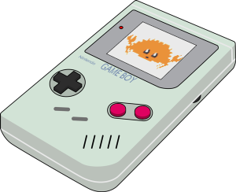

# Game Boy – med Rust!


Denne Game Boy-emulatoren er skrevet i Rust. Formålet med å utvikle den er å bli bedre kjent med hvordan Game Boy-en opprinnelig ble laget, og å få med erfaring med (relativt) lavnivåprogrammering med Rust.

Tanken er ikke å etterlikne Game Boy-en ned til minste implementasjonsdetalj, men å være tilstrekkelig tro mot konsollen til å kunne spille en rekke kjente Game Boy-spill.

## Kjøring
Du trenger to ting for å kunne kjøre spill på emulatoren:
* Spill-ROM: En fil som inneholder spillets _read-only memory_. Denne legges i katalogen `/roms`
* Boot-ROM: En 256 bytes stor fil som sjekker at spill-ROM-en er gyldig og som viser Nintendo-logoen, og deretter overlater kontroll til spill-ROM-en. Emulatoren forventer at denne ligger på rotnivå og har navnet `dmg_boot.bin`. Les mer om boot-ROM på https://gbdev.gg8.se/files/roms/bootroms/

Når disse to ROM-ene er på plass, kan du kjøre emulatoren med:

```shell
cargo run --release roms/<rom_name>.gb
```

### Argumenter
* `-x` – Skaleringsfaktor for vinduet (standard er 2)

Ekstra argumenter til `cargo run` legges til på måten:
```shell
cargo run --release -- -x 3 roms/<rom_name>.gb
```

## Testing
Test-ROM-er kan finnes på https://github.com/retrio/gb-test-roms. Legg disse i katalogen `/roms_test`.

Tester må kjøre med feature `test` aktivert:
```shell
cargo run --release --features test roms_test/<rom_name>.gb
```

## Ressurser
Under utviklingen av emulatoren har jeg fått god hjelp fra disse kildene:
* The Ultimate Game Boy Talk: https://www.youtube.com/watch?v=HyzD8pNlpwI
* PanDocs: https://gbdev.io/pandocs/
* Game Boy: Complete Technical Referance: https://gekkio.fi/files/gb-docs/gbctr.pdf
* Game Boy CPU Instructions: https://meganesu.github.io/generate-gb-opcodes/
* gb-test-roms: https://github.com/retrio/gb-test-roms
* Gameboy Emulator Development Guide: https://hacktix.github.io/GBEDG/
* Gameboy Doctor: https://robertheaton.com/gameboy-doctor/
